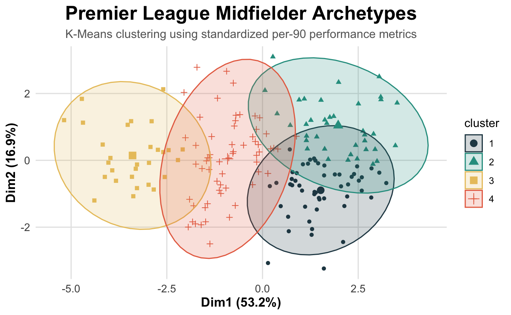
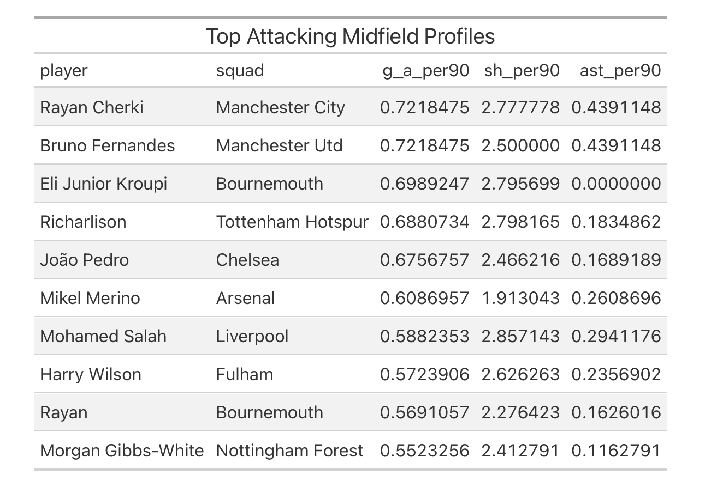

# Premier League Midfielder Archetype Analysis

This project explores how football analytics and clustering techniques can be used to identify and profile different types of midfielders in the Premier League using player performance statistics from the 2025–2026 season.

Rather than focusing only on traditional attacking statistics, this project emphasizes broader midfielder responsibilities such as:

- Defensive contribution
- Creativity
- Possession involvement
- Transitional contribution
- Overall midfield balance

The project combines football domain knowledge with statistical analysis in R to better understand stylistic differences between Premier League midfielders.

---

# Project Objectives

The main objectives of this project were to:

- Analyze statistical characteristics of Premier League midfielders
- Explore stylistic differences across modern midfield roles
- Identify midfielder archetypes using clustering techniques
- Compare player profiles using per-90 performance metrics
- Demonstrate how football analytics can support player evaluation and scouting processes

---

# Dataset

The dataset used in this project was derived from FBref player statistics from the completed 2025–2026 football season.

Original data compiled from FBref football statistics.

The original dataset contained player statistics from Europe’s top five leagues. For this project, the analysis was restricted to Premier League midfielders in order to maintain a more consistent tactical and statistical environment.

To reduce statistical noise from extremely small sample sizes, players with fewer than 10 full 90-minute equivalents (900 minutes played) were excluded from the clustering and similarity analysis.

This filtering step improves the reliability of per-90 performance metrics and reduces distortion caused by limited playing time.

While per-90 normalization helps standardize player comparisons, minimum playing-time thresholds remain important in football analytics to ensure statistical stability and more meaningful interpretation.

## Data Source

The dataset used in this project was sourced from Kaggle:

[Football Players Stats 2025–2026 Dataset](https://www.kaggle.com/datasets/hubertsidorowicz/football-players-stats-2025-2026/data?select=players_data-2025_2026.csv)

Original data compiled from FBref football statistics.

---

# Methods Used

This project was completed using:

- R
- Quarto
- tidyverse
- ggplot2
- factoextra
- gt

Main analytical steps included:

1. Data cleaning and preprocessing
2. Midfielder-focused filtering
3. Per-90 normalization
4. Exploratory data analysis
5. K-Means clustering
6. PCA-based cluster visualization
7. Statistical profile interpretation

---

# Key Findings

The clustering analysis identified several broad statistical midfielder archetypes within the Premier League, including:

- Holding Midfielders
- Box-to-Box Midfielders
- Attacking Midfielders
- Defensive Midfielders

The analysis also highlighted how modern midfield roles increasingly overlap across defensive, creative, and transitional responsibilities.

---

# Example Visualizations

## Premier League Midfielder Archetypes

## Top Attacking Midfield Profiles

---

# Full Report

The complete project report can be viewed here:

[View Full HTML Report](./modern_midfielder_scouting.html)

---

# Limitations

Football performance cannot be fully explained through statistics alone. Tactical systems, coaching styles, teammate quality, and off-ball responsibilities all influence player output and interpretation.

This project should therefore be viewed as a data-assisted football profiling exercise rather than a complete measure of player quality.

---

# Author

Taku Takahashi
